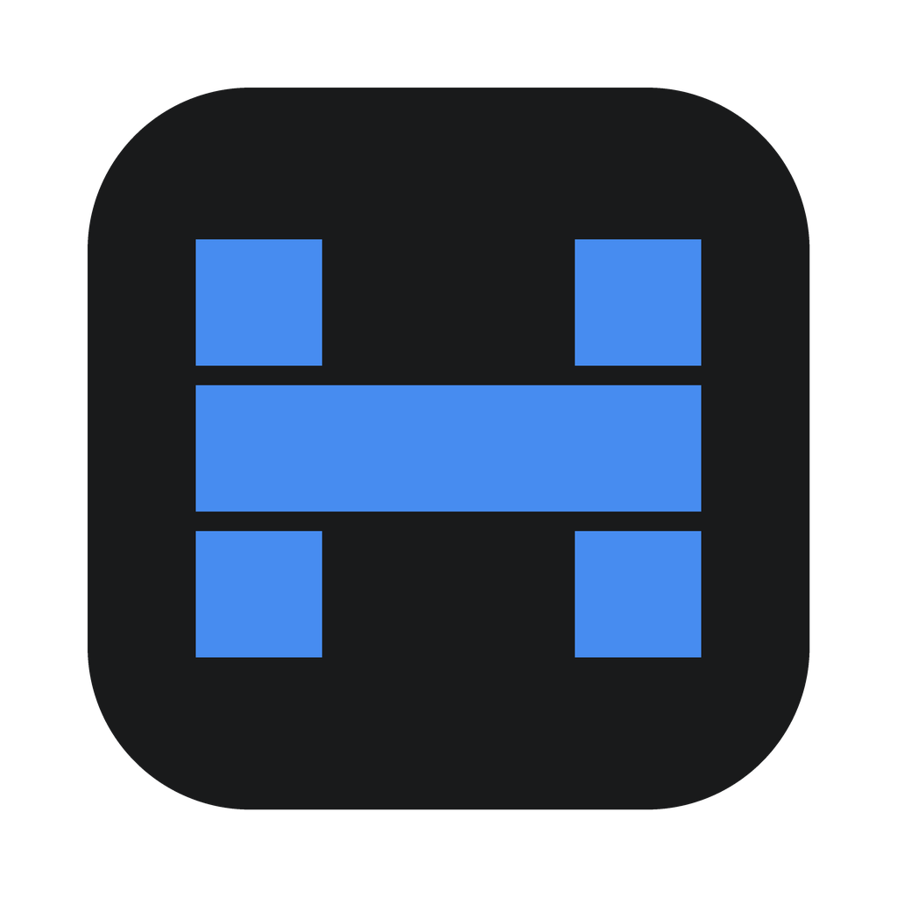

<div align="center">

# HZK CODE



**English** · [简体中文](./README.zh-CN.md)

<a href="https://atomgit.com/Tonyhzk/hzkcode" target="_blank"></a>

![][github-contributors-shield] ![][github-forks-shield] ![][github-stars-shield] ![][github-issues-shield]

</div>

**HZK CODE** is an open-source AI coding desktop client. In plain words: it brings the **Claude Code** command-line AI coding runtime into one graphical interface.

No more staring at a black terminal. Open HZK CODE, pick a project, and chat with AI to write code, fix bugs, and commit to Git. Streaming output, thinking traces, and tool calls are visible as they happen; token usage appears when the engine reports it.

The app is built with **Tauri 2 + React 18 + TypeScript + Rust** and runs on macOS, Windows, and Linux. Settings and state are persisted locally. Content sent to an AI provider follows the boundary of the channel you configured for that CLI.

---

## What can HZK CODE do?

### One client, Claude Code inside

- Registers the **Claude Code** runtime adapter — pick it from the composer's engine picker.
- **Provider channels** are written to the CLI's own native config files (no parallel credential store), with curated presets for GLM, Kimi, DeepSeek, MiniMax, MiMo, LongCat, OpenCode Go, OpenRouter, and more. Claude channels can be imported from [CC Switch](https://github.com/farion1231/cc-switch).
- Per-tab **model and effort overrides**: different tabs in the same window can run different models or thinking levels.
- Session history survives restarts; the history scanner reads the CLI's native session files and keeps titles in sync.

### A chat box designed for coding

- Streaming replies are revealed per animation frame with cached syntax highlighting — long outputs stay smooth instead of re-parsing markdown on every token.
- **Thinking streams** merge with the reply text, auto-fold when they settle, and expand to full text on demand.
- Tool calls show as live rows with expandable parameters and results, including beautified **Git Diff** and **Bash** viewers and per-run completion metadata.
- A **Run Status Strip** mirrors the engine's live progress (including todo snapshots), and a message **anchor rail** lets you jump between user messages.
- Pasted images become attachments; file mentions are backed by a `.gitignore`-aware project file index; file links in replies handle URL-encoded paths and have a right-click menu.
- Permission denials can be resolved inline by granting the engine extra directories; prompt history lives in the composer.

### Not just chat — a full set of dev panels

- **File tree**: virtualized, with Git status colors, nested-repository badges, context menus, and drag-and-drop — plus a built-in CodeMirror editor pane with Markdown preview.
- **Built-in terminal**: a real PTY-backed terminal dock (xterm + WebGL), no need to switch windows.
- **Git panel**: stage, commit, search branches, inspect diffs and history.
- **Command palette**: one keyboard-driven box for the app's commands.

### Plugin system

- First-party **plugin SDK** (`@hzkcode/plugin-sdk`) plus an in-app runtime, manager UI, and trust boundary.
- **Declarative plugins** can add settings sections and config-driven UI without shipping frontend code; builtin app surfaces (including the settings page itself) are registered through the same extension points.
- See [docs/plugin-development-guide.zh-CN.md](./docs/plugin-development-guide.zh-CN.md) for the full authoring guide.

### Settings, network, and updates

- **Proxy settings** for the app and engine traffic.
- **LAN web access**: serve the UI to other devices on your network over a token-authenticated WebSocket bridge, with a QR-code entry in Settings.
- **Workspace management**: group projects and switch between them.
- In-app **auto-update** (Tauri updater against GitHub Releases), a changelog dialog, and macOS builds.
- Bilingual UI: **Chinese and English**.

---

## Download

Grab the installer from the [Releases page](https://github.com/Tonyhzk/hzkcode/releases):

| Platform | Installer |
| --- | --- |
| macOS (Apple Silicon) | `aarch64.dmg` |

The macOS bundle is unsigned (the project has no Apple Developer certificate yet) — on first launch, right-click → Open.

After installing, open Settings, configure a provider channel for Claude Code (or sign in), add a project folder, and start chatting.

---

## Getting it running (setup guide)

Want to build it yourself or contribute? Three steps.

### Step 1: Prepare your environment

| Tool | Version | What for |
| --- | --- | --- |
| [Node.js](https://nodejs.org/) | 20 or newer | Runs the frontend toolchain |
| [pnpm](https://pnpm.io/) | 10 (pinned via `packageManager`) | Installs dependencies |
| [Rust](https://rustup.rs/) | stable (install via rustup) | Compiles the backend |

Each OS also needs the standard Tauri prerequisites — see the [official Tauri guide](https://v2.tauri.app/start/prerequisites/):

- **macOS**: `xcode-select --install`.
- **Windows**: Microsoft C++ Build Tools and WebView2 (Windows 11 ships with WebView2).
- **Linux**: `webkit2gtk` and friends — copy the commands from the Tauri docs.

### Step 2: Install dependencies

```bash
git clone https://github.com/Tonyhzk/hzkcode.git
cd hzkcode
pnpm install
```

Note: this is a **pnpm workspace** (the plugin SDK lives in `packages/plugin-sdk`); the lockfile is `pnpm-lock.yaml`.

### Step 3: Start it

```bash
pnpm dev
```

A few tips:

- **The first launch compiles the entire Rust backend and can take a few minutes** — go grab a coffee. Later launches use incremental builds and are fast.
- The frontend dev server runs on port `14210`.

### Building installers

```bash
pnpm build:mac   # macOS build (scripts/build-macos.sh)
```

Releases are built locally and manually — there is no CI pipeline.

---

## How to work on the code (development guide)

### Tech stack at a glance

| Part | Technology |
| --- | --- |
| UI | React 18 + TypeScript + Tailwind CSS 4 + zustand |
| Build | Vite 6 |
| Desktop shell | Tauri 2 (Rust backend: git2, rusqlite, portable-pty, axum) |
| Tests | Vitest (frontend) + cargo test (Rust) |

### Directory layout

```text
hzkcode/
├── src/                    # Frontend code
│   ├── features/           # ★ Feature modules: chat / files / git / terminal /
│   │                       #   settings / plugins / commands / update / open-app
│   ├── components/         # Shared UI components (incl. engine brand icons)
│   ├── i18n/               # zh + en locale bundles
│   ├── styles/             # Global styles
│   └── lib/ utils/         # Utility functions
├── src-tauri/              # Rust backend
│   └── src/                # engine/ (CLI engine adapters), history/, plugins/,
│                           # git.rs, terminal.rs, web.rs (LAN bridge), ...
├── packages/plugin-sdk/    # @hzkcode/plugin-sdk — plugin authoring kit
├── tests/                  # Frontend integration-style tests (Vitest)
├── scripts/                # Build and packaging scripts
└── docs/                   # Plugin development guide
```

### The typical workflow for changing a feature

1. **UI-only change**: find the matching module under `src/features/` and edit there. New components live inside that feature's own folder.
2. **Needs backend support**: add a `#[tauri::command]` in the matching `src-tauri/src/` module and call it from the frontend via the Tauri API.
3. **Changed any UI text**: route it through i18n and keep both bundles (`src/i18n/zh.ts`, `src/i18n/en.ts`) synchronized — hardcoded UI text is not allowed.

### Everyday commands

| Command | What it does |
| --- | --- |
| `pnpm dev` | Start the full app (Tauri dev mode) |
| `pnpm build` | TypeScript check + frontend production build |
| `pnpm test` | Run the Vitest suite |
| `pnpm preview` | Preview the production frontend build |
| `cargo test --manifest-path src-tauri/Cargo.toml` | Run Rust tests |

### Writing tests

- Frontend tests use [Vitest](https://vitest.dev/) — colocated `xxx.test.ts(x)` files next to the source, plus heavier suites under `tests/`.
- Rust tests live in their modules as usual and run with `cargo test --manifest-path src-tauri/Cargo.toml`.

---

## Coding rules

Not many rules, but each exists for a reason:

1. **Run the big three before opening a PR**: `pnpm build` (typecheck) and `pnpm test` green locally, plus `cargo test` if you touched Rust.
2. **UI text must go through i18n**: every user-visible string comes from `src/i18n/`, and both shipped locale bundles must stay synchronized.
3. **Keep components close to home**: new components start inside their own feature folder; promote to `src/components/` only once they're genuinely reused across features.
4. **TypeScript strict**: don't paper over things with `any`; write real types.
5. **Extend through the plugin SDK where possible**: new settings sections and surfaces should register through the same extension points the builtin ones use.
6. **Never commit secrets**: API keys and tokens must never appear in code or commit history.

### Writing commit messages

Use [Conventional Commits](https://www.conventionalcommits.org/) with a Chinese action phrase by default: `type(scope): 中文动宾短句`.

| type | When to use |
| --- | --- |
| `feat` | New feature |
| `fix` | Bug fix |
| `refactor` | Refactoring (no behavior change) |
| `docs` | Documentation |
| `test` | Adding/updating tests |
| `chore` | Housekeeping (version bumps, deps, scripts) |
| `perf` / `style` / `ci` | Performance / formatting / CI |

Real examples from this repo:

```text
feat(chat): 支持工具调用参数与结果展开、Git Diff/Bash美化及完成元数据展示
fix(chat): message file links failed to resolve in nested projects
perf(chat): reveal streamed text per frame without reparsing markdown
```

No emoji in commit messages, and no AI-generated signatures.

---

## Submitting your code (contribution flow)

1. **Fork** the repo and clone it locally.
2. Branch off `main`, named like `feat/xxx` or `fix/xxx`.
3. Make your changes and get `pnpm build` + `pnpm test` green locally.
4. Open a PR against this repo's **`main` branch**. Title in commit format; in the description, explain what changed, why, and how you verified it.

Not sure where to start? Browse the [Issues](https://github.com/Tonyhzk/hzkcode/issues) and pick one that interests you. Found a bug or have an idea? Open an issue and let's talk.

### Want to dig deeper?

- [Plugin development guide (中文)](docs/plugin-development-guide.zh-CN.md) — SDK, manifest, permissions, and the trust boundary.

---

## License

[MIT](https://github.com/Tonyhzk/hzkcode?tab=MIT-1-ov-file)

---

## Friendship Link

Thanks for the support and feedback from the friends at [LINUX DO](https://linux.do/).

[AtomGit](https://atomgit.com/Tonyhzk/hzkcode): hosts this project in China, helping users in mainland China access the project and download Releases faster.

Thank you for [AtomGit](https://atomgit.com/Tonyhzk/hzkcode) platform G-Star certification

---

## Contributors

Thanks to all the contributors who help make HZK CODE better.

<a href="https://github.com/Tonyhzk/hzkcode/graphs/contributors">
  
</a>

---

## Acknowledgements

This project originally started from [CodexMonitor](https://github.com/Dimillian/CodexMonitor). Since v1.0.0 the codebase has been rewritten from scratch — no CodexMonitor code remains, but the original inspiration is gratefully acknowledged.

---

## Star History

[](https://star-history.dera.page/#Tonyhzk/hzkcode&type=date&legend=top-left)

<!-- LINK GROUP -->

[github-contributors-shield]: https://img.shields.io/github/contributors/Tonyhzk/hzkcode?color=c4f042&labelColor=black&style=flat-square
[github-forks-shield]: https://img.shields.io/github/forks/Tonyhzk/hzkcode?color=8ae8ff&labelColor=black&style=flat-square
[github-issues-link]: https://github.com/Tonyhzk/hzkcode/issues
[github-issues-shield]: https://img.shields.io/github/issues/Tonyhzk/hzkcode?color=ff80eb&labelColor=black&style=flat-square
[github-license-link]: https://github.com/Tonyhzk/hzkcode/blob/main/LICENSE
[github-stars-shield]: https://img.shields.io/github/stars/Tonyhzk/hzkcode?color=ffcb47&labelColor=black&style=flat-square
